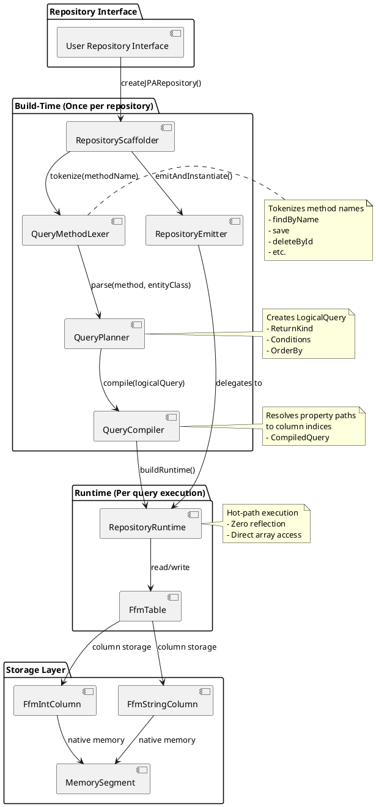
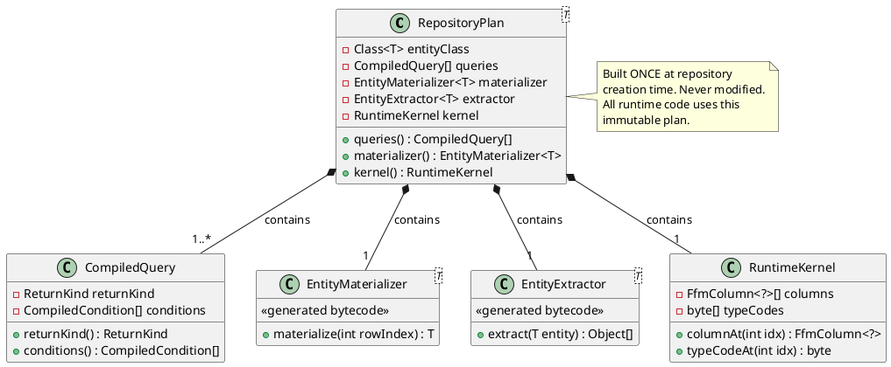
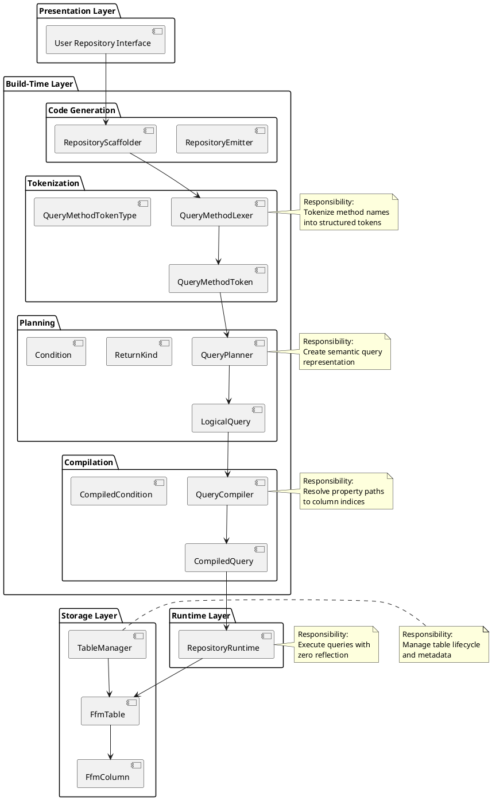
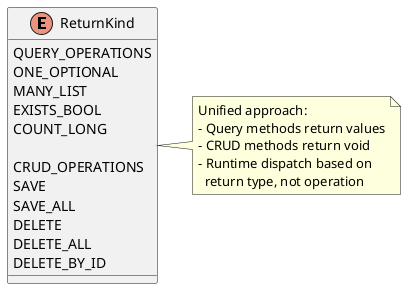
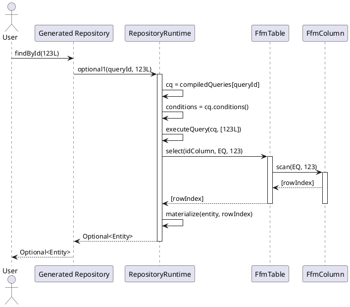
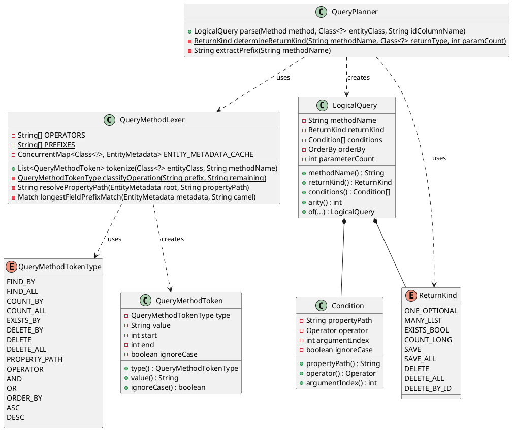
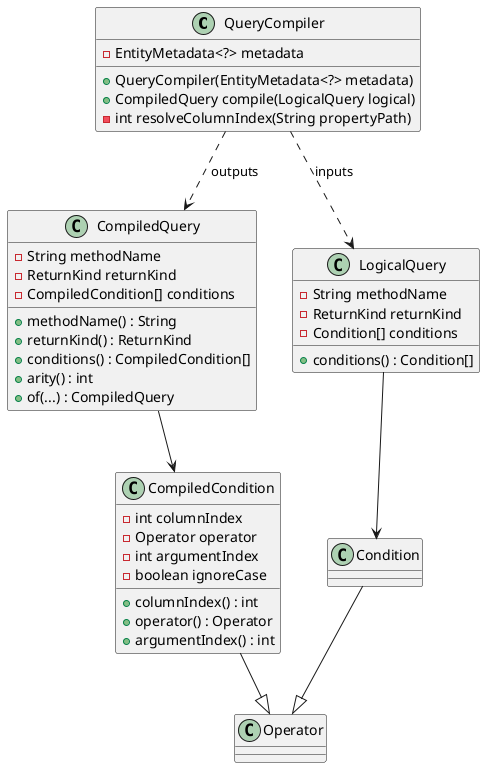
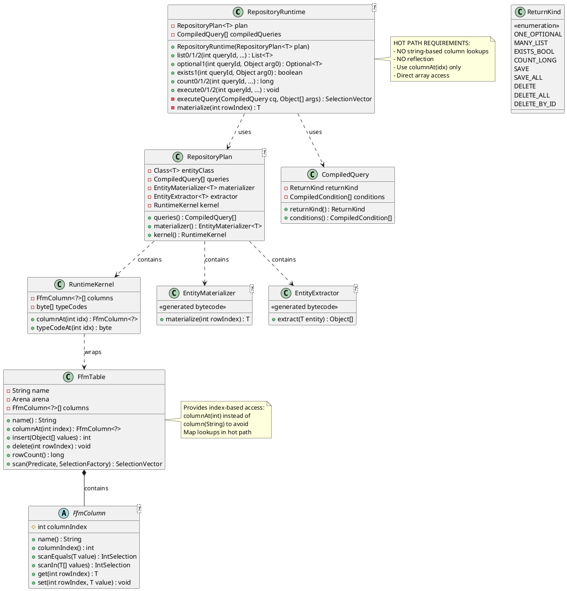
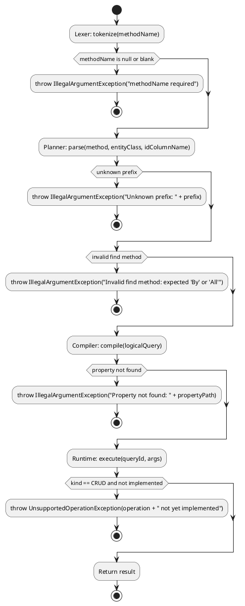

# Memris Architecture Documentation

## Overview

Memris is a blazingly fast, multi-threaded, in-memory storage engine for Java 21 with Spring Data JPA repository integration via dynamic bytecode generation.

**Key Design Principles:**
1. **O(1) First** - No O(n) operations allowed in hot paths
2. **Zero Reflection Hot Path** - No reflection in runtime query execution
3. **No Maps/String Lookups Hot Path** - Runtime MUST use index-based access only
4. **Primitive-Only APIs** - No boxed types in hot paths
5. **Compile Once, Reuse Forever** - All compilation happens at repository creation time
6. **Generic Pattern Matching** - No per-repository hardcoding

---

## High-Level Architecture



---

## Build-Time vs Runtime Pipelines

**CRITICAL:** Compilation happens ONCE at repository creation time. Runtime NEVER runs lexer/planner/compiler.

### Build-Time Pipeline (Once per repository)

```plantuml
@startuml
package "Build-Time (Repository Creation)" {
    rectangle "Methods" {
        method "findById(Long)" as m1
        method "findByName(String)" as m2
        method "save(T)" as m3
    }

    [QueryMethodLexer] as Lexer
    [QueryPlanner] as Planner
    [QueryCompiler] as Compiler
    [RepositoryEmitter] as Emitter

    package "Compiled Artifacts" {
        [CompiledQuery[]] as CQArray
        [RepositoryPlan<T>] as Plan
    }

    m1 --> Lexer : tokenize(methodName)
    m2 --> Lexer : tokenize(methodName)
    m3 --> Lexer : recognized by signature (not tokenized)

    Lexer --> Planner : List<Token>
    Planner --> Compiler : LogicalQuery

    Compiler --> CQArray : CompiledQuery per query method

    CQArray --> Plan : RepositoryPlan
    Plan --> Emitter : emit bytecode

    note right of Plan
      RepositoryPlan contains:
      - CompiledQuery[] queries
      - EntityMaterializer<T>
      - EntityExtractor<T>
      - RuntimeKernel with column arrays
    end note

    note right of m3
      CRUD methods recognized
      by signature, NOT
      tokenized through lexer
      (save, deleteById, etc.)
    end note
}
@enduml
```

### Runtime Pipeline (Per invocation)

```plantuml
@startuml
actor User

package "Generated Repository" {
    method "findById(Long id)" as findById
    method "save(T entity)" as save
}

package "RuntimeKernel" {
    [RepositoryRuntime] as Runtime
    [FfmTable] as Table
}

package "Storage" {
    [IntColumn] as IntCol
    [StringColumn] as StrCol
}

User -> findById : call
findById -> Runtime : optional1(Q_FIND_BY_ID, id)
activate Runtime

Runtime -> Runtime : cq = compiledQueries[queryId]
Runtime -> IntCol : scanEquals(columnIdx, value)
activate IntCol
IntCol --> Runtime : SelectionVector
deactivate IntCol

Runtime -> Runtime : materialize(entity, rowIndex)
Runtime --> findById : Optional<T>
deactivate Runtime

findById --> User : return

note right of findById
  Generated method is
  a thin wrapper:
  return runtime.optional1(
    Q_FIND_BY_ID, id);
end note

note right of Runtime
  NO lexer/planner/compiler
  NO string-based column lookups
  NO reflection
  Direct array access only
end note
@enduml
```

### Runtime Hard Requirements

**MUST NOT:**
- Call `FfmTable.getX(String columnName, ...)` - uses Map lookup
- Call `FfmTable.column(String columnName)` - uses Map lookup
- Use reflection for field access
- Parse method names at runtime

**MUST:**
- Use `columns[columnIndex]` - array access
- Use pre-resolved column indices from CompiledCondition
- Use MethodHandles pre-compiled at build time
- Dispatch by queryId (integer)

---

## RepositoryPlan: The Single Compiled Artifact

**Purpose:** `RepositoryPlan<T>` is the compile-once artifact that prevents drift and enforces the "no runtime work" principle.



**Generated Repository Methods become tiny wrappers:**

```java
// findById - generated bytecode
@Override
public Optional<User> findById(Long id) {
    return runtime.optional1(Q_FIND_BY_ID, id);
}

// save - generated bytecode
@Override
public <S extends User> S save(S entity) {
    runtime.execute1(Q_SAVE, entity);
    return entity;
}
```

---

## Layer Separation (SRP)



---

## Method Name Tokenization vs Signature Recognition

### Query Methods: Tokenized by Lexer

**QueryMethodLexer** uses generic pattern matching for query methods only.

**Lexer PREFIXES:** `find`, `read`, `query`, `get`, `count`, `exists`

**NOTE:** `save` and `delete` are NOT in PREFIXES - they are recognized by signature (see below).

```plantuml
@startuml
start
:Input: methodName (query only);
:extractPrefix(methodName);

switch (prefix.toLowerCase())
case "find" / "read" / "query" / "get"
  if (remaining == "All") then
    :token = FIND_ALL;
  elseif (remaining.startsWith("By")) then
    :token = FIND_BY;
    :processPredicates(remaining);
  endif
case "count"
  if (remaining.startsWith("By")) then
    :token = COUNT_BY;
  else
    :token = COUNT_ALL;
  endif
case "exists"
  :token = EXISTS_BY;
  :processPredicates(remaining);
endswitch

:Output: List<QueryMethodToken>;
stop
@enduml
```

### CRUD Methods: Recognized by Signature (NOT tokenized)

CRUD methods are recognized by their Spring Data signatures, not by the lexer:

| Method | Signature Pattern | Operation |
|--------|------------------|-----------|
| `save` | `<S extends T> S save(S entity)` | SAVE |
| `saveAll` | `<S extends T> Iterable<S> saveAll(Iterable<S>)` | SAVE_ALL |
| `deleteById` | `void deleteById(ID id)` | DELETE_BY_ID |
| `delete` | `void delete(T entity)` | DELETE |
| `deleteAll` | `void deleteAll()` or `void deleteAll(Iterable<? extends T>)` | DELETE_ALL |
| `count` | `long count()` | COUNT_ALL |
| `existsById` | `boolean existsById(ID id)` | EXISTS_BY_ID |
| `findById` | `Optional findById(ID id)` | FIND_BY (id column) |
| `findAll` | `Iterable findAll()` | FIND_ALL |

**Rationale:** These methods have well-known Spring Data signatures. Tokenizing them adds unnecessary complexity and risks runtime interpretation.

Both query and CRUD methods ultimately produce `CompiledQuery` objects with assigned `queryId` values, maintaining a unified runtime dispatch while keeping compilation paths appropriate to each method type.

```plantuml
@startuml
start

:Input: methodName;
:extractPrefix(methodName);

switch (prefix.toLowerCase())
case "find" / "read" / "query" / "get"
  if (remaining == "All") then
    :token = FIND_ALL;
  elseif (remaining.startsWith("By")) then
    :token = FIND_BY;
    :processPredicates(remaining);
  endif
case "count"
  if (remaining.startsWith("By")) then
    :token = COUNT_BY;
  else
    :token = COUNT_ALL;
  endif
case "exists"
  :token = EXISTS_BY;
  :processPredicates(remaining);
case "delete"
  if (remaining.startsWith("ById")) then
    :token = DELETE_BY_ID;
  elseif (remaining == "All") then
    :token = DELETE_ALL;
  else
    :token = DELETE;
  endif
case "save"
  if (remaining == "All") then
    :token = SAVE_ALL;
  else
    :token = SAVE;
  endif
endswitch

:Output: List<QueryMethodToken>;

stop
@enduml
```

---

## ReturnKind Enum

**ReturnKind** describes both operation type and return type for unified compilation.



---

## Runtime Method Dispatch

**RepositoryRuntime** uses unified entrypoints based on return type, not operation type.

```plantuml
@startuml
start

:Input: queryId, args;
:CQ = compiledQueries[queryId];
:kind = CQ.returnKind();

if (kind is CRUD operation) then
  :route to execute method;
  switch (arity)
  case 0
    :execute0(queryId);
  case 1
    :execute1(queryId, arg0);
  case 2
    :execute2(queryId, arg0, arg1);
  endswitch

  :execute method checks kind;
  if (kind == SAVE) then
    :// TODO: implement save;
  elseif (kind == DELETE) then
    :// TODO: implement delete;
  elseif (kind == DELETE_BY_ID) then
    :// TODO: implement deleteById;
  elseif (kind == DELETE_ALL) then
    :// TODO: implement deleteAll;
  endif

else
  :route to typed method;
  switch (kind)
  case ONE_OPTIONAL
    :optional1(queryId, arg0);
  case MANY_LIST
    :switch (arity)
     case 0: list0(queryId)
     case 1: list1(queryId, arg0)
     case 2: list2(queryId, arg0, arg1)
    endswitch
  case EXISTS_BOOL
    :exists1(queryId, arg0);
  case COUNT_LONG
    :switch (arity)
     case 0: count0(queryId)
     case 1: count1(queryId, arg0)
     case 2: count2(queryId, arg0, arg1)
    endswitch
  endswitch
endif

stop
@enduml
```

---

## Query Execution Flow



---

## Class Diagram: Query Planning



---

## Class Diagram: Compilation



---

## Class Diagram: Runtime



---

## Data Structures

### LogicalQuery (Build-time)
```plantuml
@startuml
object LogicalQuery {
  methodName = "findById"
  returnKind = ONE_OPTIONAL
  conditions = [
    Condition {
      propertyPath = "id"
      operator = EQ
      argumentIndex = 0
      ignoreCase = false
    }
  ]
  orderBy = null
  parameterCount = 1
}
@enduml
```

### CompiledQuery (Runtime)
```plantuml
@startuml
object CompiledQuery {
  methodName = "findById"
  returnKind = ONE_OPTIONAL
  conditions = [
    CompiledCondition {
      columnIndex = 0  // resolved at compile time
      operator = EQ
      argumentIndex = 0
      ignoreCase = false
    }
  ]
}
@enduml
```

---

## Error Handling Flow



---

## Key Design Decisions

### 1. Unified Compilation Strategy
**Decision:** All methods (query + CRUD) become CompiledQuery with assigned queryIds

**Rationale:**
- Query methods: Lexer → Planner → Compiler (pattern-based)
- CRUD methods: Direct Compiler invocation (signature-based)
- Unified runtime dispatch via queryId integer
- No per-repository hardcoding; patterns are generic across all repositories

**Clarification:** We DO hardcode known Spring Data signatures (save, deleteById, findAll, etc.) and operators (Between, In, OrderBy, etc.). The "generic" claim means no per-repository hardcoding.

### 2. ReturnKind Enum
**Decision:** ReturnKind describes both operation type and return type

**Rationale:**
- No separate OperationType enum needed
- Return type determines runtime method dispatch
- Simple and explicit

### 3. Arity vs ParameterCount
**Decision:** Track `parameterCount` separately from `conditions.length`

**Rationale:**
- `save(T entity)` has 1 parameter but 0 conditions
- `deleteById(Object id)` has 1 parameter and 0 conditions (ID is entity to delete, not filter)
- Arity represents method parameters, not query conditions

### 4. Zero Reflection Hot Path
**Decision:** Pre-compile everything at build time, use integer indices at runtime

**Rationale:**
- String lookups are O(n)
- Array access is O(1)
- MethodHandles faster than reflection

---

## Future Work

### TODO: Implement CRUD Operations
```plantuml
@startuml
card "CRUD Implementation" {
  execute1 {
    kind = SAVE
    -> Extract ID from entity
    -> Insert into table columns

    kind = DELETE
    -> Extract ID from entity
    -> Delete row by ID

    kind = DELETE_BY_ID
    -> Delete row by ID

    kind = SAVE_ALL
    -> For each entity
    -> Insert into table

    kind = DELETE_ALL
    -> Clear all rows
  }
}
@enduml
```

### TODO: Support More Query Patterns
- `findAllById(List<ID> ids)` - IN clause with multiple IDs
- `findByXxxIn(List<?> values)` - IN clause
- `findByXxxBetween(min, max)` - BETWEEN clause
- `findByXxxOrderByYyyDescZzzAsc()` - multi-column sorting

---

## Performance Characteristics

| Operation | Complexity | Notes |
|-----------|-----------|-------|
| Tokenization | O(m) | m = method name length |
| Planning | O(t + c) | t = tokens, c = conditions |
| Compilation | O(c * f) | c = conditions, f = fields to scan |
| Execution | O(r * c) | r = rows matching, c = conditions |
| Materialization | O(f) | f = fields per entity |

**Hot Path (Execution):**
- No string allocations
- No reflection
- Direct array access
- SIMD vector scans (where applicable)

---

## References

- **TDD Progress:** See `TDD_PROGRESS.md`
- **Agent Guidelines:** See `AGENTS.md`
- **User Guidelines:** See `CLAUDE.md`
