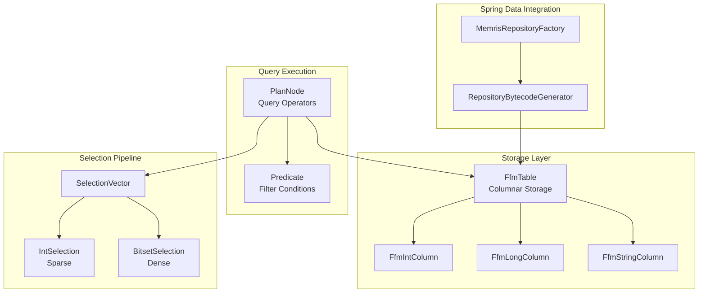
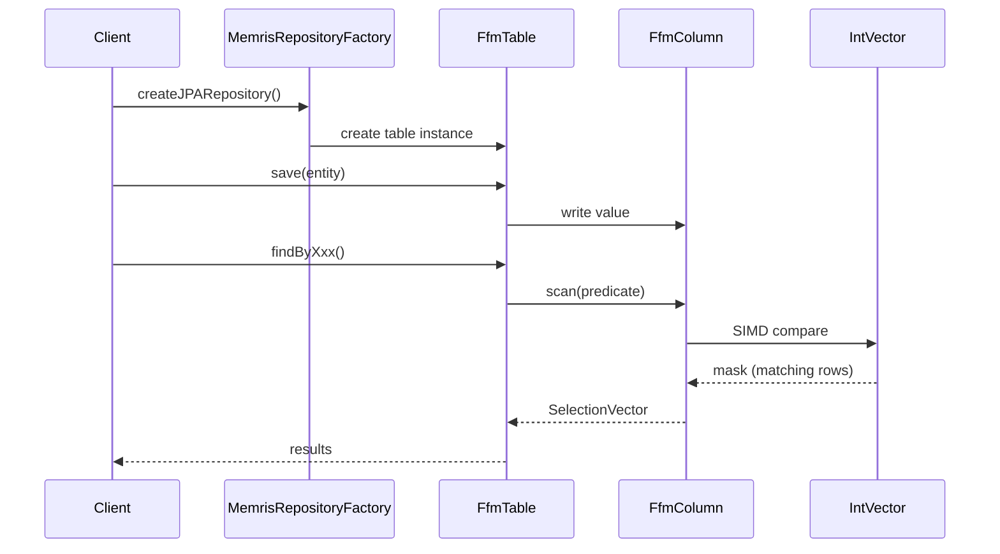

# Memris

## The Vibe

**Memris** = "Memory" + "Iris" — an in-memory storage engine that can *see* through the heap instantly. Like iris (the eye), it provides vision/insight into your data. Like iris (a flower), it blooms fast.

> "Iris suggests looking through data/vision. It sounds like an engine that can 'see' through the heap instantly."

## What is Memris?

**Memris** is a blazingly fast, multi-threaded, in-memory storage engine for Java 21 with SIMD vectorized execution and Spring Data integration.

### Performance Results (10M rows, 228MB)

| Operation | Time | Throughput | Selectivity |
|-----------|------|------------|-------------|
| Full table scan | 15-16ms | **14.3 GB/s** | 100% |
| Point filter (status='pending') | 46ms | - | 50% |
| Range query (amount 10k-20k) | 9-23ms | - | 10% |
| SelectionVector create | 16-23ms | - | - |
| SelectionVector enumerate | 24-30ms | - | - |

## Architecture





### Primitive-Only Design (JVM Optimized)
- `IntEnumerator` / `LongEnumerator` - No boxing
- All classes `final` for inlining
- O(1) operations preferred, O(log n) second, O(n) forbidden

## Java Runtime Requirements

- **Java Version**: 21 (required)
- **Preview Features**: `--enable-preview`
- **Modules**: `jdk.incubator.vector` (for SIMD), `java.base` (FFM)
- **Native Access**: `--enable-native-access=ALL-UNNAMED`

## Quick Start

```java
// Define repository interface with JPA query methods
interface UserRepository extends MemrisRepository<User> {
    List<User> findByLastname(String lastname);
    List<User> findByAgeGreaterThan(int age);
    List<User> findByStatusIn(Collection<String> statuses);
}

// Create repository
try (MemrisRepositoryFactory factory = new MemrisRepositoryFactory()) {
    UserRepository repo = factory.createJPARepository(UserRepository.class);
    
    // Save entities
    repo.save(new User(1, "Alice", 30));
    repo.save(new User(2, "Bob", 25));
    
    // Query using JPA query methods
    List<User> alice = repo.findByLastname("Alice");
    List<User> adults = repo.findByAgeGreaterThan(18);
    List<User> vip = repo.findByStatusIn(List.of("gold", "platinum"));
}
```

### Entity Class

```java
final class User {
    int id;
    String name;
    int age;
    
    User() {}
    User(int id, String name, int age) {
        this.id = id;
        this.name = name;
        this.age = age;
    }
}
```

## Design Principles

Memris is built on these core design principles for maximum performance:

1. **O(1) First** - All hot path operations must be constant time
2. **Primitive-Only APIs** - No boxing, no Iterator, no Iterable in hot paths
3. **SIMD Vectorization** - Panama Vector API for batch processing
4. **Memory Efficiency** - FFM MemorySegment for off-heap storage
5. **JVM Optimization** - Final classes for inlining, type switches for dispatch
6. **Type Safety** - Compile-time type-safe queries with no string-based operations
7. **Extensible** - Custom type converters for unsupported types

For detailed implementation guidelines, see [AGENTS.md](AGENTS.md) and [CLAUDE.md](CLAUDE.md).

## Type Conversion & Extensibility

Memris supports all Java primitives and common types out-of-the-box:

### Supported Types

| Type | Storage Type | Notes |
|------|---------------|-------|
| `int`, `Integer` | `int` | Direct mapping |
| `long`, `Long` | `long` | Direct mapping |
| `boolean`, `Boolean` | `boolean` | Direct mapping |
| `byte`, `Byte` | `byte` | Direct mapping |
| `short`, `Short` | `short` | Direct mapping |
| `float`, `Float` | `float` | Direct mapping |
| `double`, `Double` | `double` | Direct mapping |
| `char`, `Character` | `char` | Direct mapping |
| `String` | `String` | Variable-length storage |
| `BigDecimal` | `String` | ISO format, no precision loss |
| `BigInteger` | `String` | ISO format, arbitrary precision |
| `LocalDate` | `String` | ISO format |
| `LocalDateTime` | `String` | ISO format |
| `LocalTime` | `String` | ISO format |
| `Instant` | `String` | ISO format |
| `java.sql.Date` | `String` | ISO format |
| `java.sql.Timestamp` | `String` | ISO format |

### Custom Type Support

Clients can register custom TypeConverters for unsupported types:

```java
// Define custom converter
class UUIDConverter implements TypeConverter<UUID, String> {
    @Override public Class<UUID> getJavaType() { return UUID.class; }
    @Override public Class<String> getStorageType() { return String.class; }
    @Override public String toStorage(UUID value) { return value.toString(); }
    @Override public UUID fromStorage(String value) { return UUID.fromString(value); }
}

// Register converter before creating repository
TypeConverterRegistry.getInstance().register(new UUIDConverter());

// Now UUID fields work automatically
class User {
    UUID id;
    String name;
}
```

## Spring Data Integration

`MemrisRepositoryFactory` creates Spring Data JPA-style repositories with dynamic query derivation:

```java
// Define extended repository interface
interface UserRepository extends MemrisRepository<User> {
    List<User> findByLastname(String lastname);
    List<User> findByAgeGreaterThan(int age);
    List<User> findByStatusIn(Collection<String> statuses);
    List<User> findByNameContaining(String name);
    List<User> findByActiveTrue();
    List<User> findByAgeOrderByLastnameDesc(int age);
    List<User> findFirst10ByActiveTrue();
}

// Use with factory
try (MemrisRepositoryFactory factory = new MemrisRepositoryFactory()) {
    UserRepository userRepo = factory.createJPARepository(UserRepository.class);
    List<User> vips = userRepo.findByActiveTrue();
}
```

For detailed query syntax and supported operators, see [docs/queries.md](docs/queries.md).

## Running Benchmarks

Memris provides two types of benchmarks:

### Throughput Benchmark
Measures maximum throughput operations:
```bash
mvn.cmd compile
java --enable-preview --add-modules jdk.incubator.vector -cp memris-core/target/classes io.memris.benchmarks.ThroughputBenchmark
```

### Latency Benchmark (JMH)
Microbenchmark suite for detailed latency analysis:
```bash
mvn.cmd clean compile
java --enable-preview --add-modules jdk.incubator.vector -cp memris-core/target/classes:jmh-benchmarks.jar io.memris.benchmarks.MemrisBenchmarks
```

## Running Tests

```bash
mvn.cmd test -X                 # All tests (show warnings only)
mvn.cmd test -X -Dtest=ClassName   # Single test class (show warnings only)
mvn.cmd test -X -Dtest=ClassName#methodName  # Single test (show warnings only)
```

For testing guidelines and best practices, see [AGENTS.md](AGENTS.md).

## License

MIT
