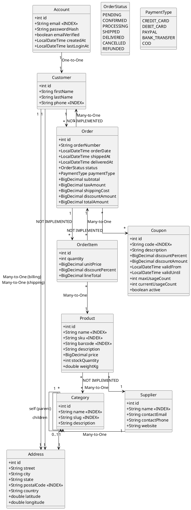
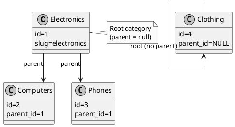

# Memris - E-Commerce Domain Model

## Overview

This document describes the real-world e-commerce domain model implemented in `ECommerceRealWorldTest.java`. It demonstrates Memris's support for @ManyToOne and @OneToOne relationships using manual foreign key fields (long) for relationship storage.

## Entity Relationship Diagram



## Category Hierarchy (Self-Referential)



## Query Patterns Supported

### Equality Queries (Hash Index)

```java
// Indexed fields - O(1) lookup
Product findBySku(String sku);           // HashIndex on sku
Product findByBarcode(String barcode);   // HashIndex on barcode
Coupon findByCode(String code);          // HashIndex on code
Customer findByAccountEmail(String email); // HashIndex on email
```

### Range Queries (BTree Index)

```java
// Range queries - O(log n) lookup
List<Product> findByPriceGreaterThan(BigDecimal price);
List<Product> findByPriceLessThan(BigDecimal price);
List<Product> findByPriceBetween(BigDecimal min, BigDecimal max);
List<Order> findByTotalAmountGreaterThan(BigDecimal amount);
List<Order> findByOrderDateBetween(LocalDateTime start, LocalDateTime end);
```

### Pattern Matching

```java
// LIKE queries - O(n) scan
List<Category> findBySlug(String slug);              // Exact match
List<Category> findByNameContaining(String keyword); // LIKE %keyword%
List<Product> findBySkuStartingWith(String prefix);  // LIKE prefix%
List<Customer> findByLastNameContaining(String part); // LIKE %part%
```

### Combined Conditions

```java
// Multiple conditions - in-memory AND after indexed fetch
List<Product> findByNameContainingAndPriceLessThan(String name, BigDecimal maxPrice);
List<Order> findByStatusAndTotalAmountGreaterThan(OrderStatus status, BigDecimal amount);
```

### Enum Queries

```java
// Enum mapped as STRING or ORDINAL
List<Order> findByStatus(OrderStatus status);  // WHERE status = 'DELIVERED'
List<Order> findByPaymentType(PaymentType type); // WHERE payment_type = 0
```

## Index Strategy

| Field | Index Type | Use Case |
|-------|------------|----------|
| `sku`, `barcode`, `code` | HASH | Exact match lookups |
| `email`, `phone` | HASH | Customer lookup by contact |
| `slug`, `name` | HASH | Category/product lookup |

**Note:** RangeIndex (O(log n)) is available but not demonstrated in this example.

## Performance Characteristics

| Query Type | Without Index | With Index |
|------------|---------------|------------|
| `findBySku("PRO-LP-001")` | O(n) scan | O(1) HashIndex |
| `findByPriceBetween(100, 500)` | O(n) scan | O(log n) RangeIndex |
| `findByStatus(SHIPPED)` | O(n) scan | O(1) if HashIndex exists |

## Test Coverage

The `ECommerceRealWorldTest` includes 12 comprehensive query tests:

1. ✅ Find by indexed SKU
2. ✅ Price range query
3. ✅ Low stock detection
4. ✅ Order status filtering
5. ✅ Amount-based filtering
6. ✅ Name pattern matching
7. ✅ Slug-based lookup
8. ✅ Active coupon retrieval
9. ✅ Self-referential hierarchy
10. ✅ Combined status + amount query
11. ✅ Name contains + price constraint
12. ✅ Related entity field queries

**Note:** @Embeddable, @Enumerated, and lifecycle callbacks (@PrePersist, @PostLoad) are NOT implemented. Entities use manual foreign key fields (long) for relationships.

## Usage Example

```java
// Generate tables (build-time via TableGenerator)
GeneratedTable productTable = TableGenerator.generate(productMetadata)
    .getConstructor(int.class, int.class, int.class)
    .newInstance(1024, 100, 1);
GeneratedTable orderTable = TableGenerator.generate(orderMetadata)
    .getConstructor(int.class, int.class, int.class)
    .newInstance(1024, 100, 1);

// Save entities
productTable.insertFrom(new Object[]{1L, "PRO-LP-001", "Laptop", 999.99});
orderTable.insertFrom(new Object[]{1L, 1L, 999.99, "SHIPPED"});

// Query using GeneratedTable methods
long productRef = productTable.lookupByIdString("PRO-LP-001");
int[] shippedOrders = orderTable.scanEqualsString(3, "SHIPPED");
int[] affordableProducts = productTable.scanLessThanDouble(3, 500.0);
```
